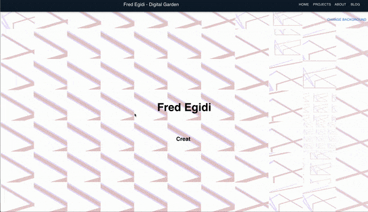

# Personal Blog and Portfolio

Personal Portfolio WebPage / Curriculum / 

Made using React and NodeJs and Material Ui

## Table of Contents

- [Demo](#demo)
- [Features](#features)
- [Usage](#usage)
- [Technologies Used](#technologies-used)
- [Contributing](#contributing)

## Demo

You can see a live demo of this application [here](https://blogandportfolio.netlify.app/).

Provide an introduction to your project. Explain what it does, its purpose, and any relevant background information. You can also include a screenshot or a GIF to showcase the project.

## Features

- Dinamic changing background according to the mouse position

- Generative backgrounds with the option to change parameters
  

## Technologies Used
React
Node.js
Material Ui
Contentful

## Contributing

I would be happy to hear your feedback or some improvement suggestions please  don't hesitate to reach out to me